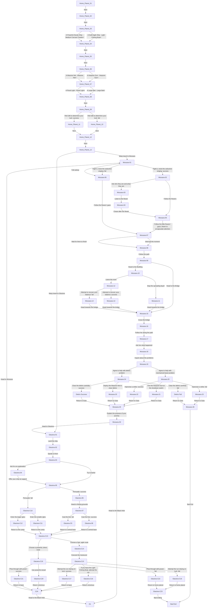

# Story Flow (assets/story.txt)

```mermaid
flowchart TD
A1["Home_Planet_01"]
A2["Home_Planet_02"]
A3["Home_Planet_03"]
A4["Home_Planet_04"]
A5["Home_Planet_05"]
A6["Home_Planet_06"]
A7["Home_Planet_07"]
A8["Home_Planet_08"]
A9["Home_Planet_09"]
A10["Home_Planet_10"]
A11["Home_Planet_11"]
A12["Home_Planet_12"]
A13["Home_Planet_13"]
B1["Mossara-01"]
B2["Mossara-02"]
B3["Mossara-03"]
B4["Mossara-04"]
B5["Mossara-05"]
B6["Mossara-06"]
B7["Mossara-07"]
B8["Mossara-08"]
B9["Mossara-09"]
B10["Mossara-10"]
B11["Mossara-11"]
B12["Mossara-12"]
B13["Mossara-13"]
B14["Mossara-14"]
B15["Mossara-15"]
B16["Mossara-16"]
B17["Mossara-17"]
B18["Mossara-18"]
B19["Mossara-19"]
B20["Mossara-20"]
B21["Mossara-21"]
B22["Mossara-22"]
B23["Mossara-23"]
B24["Mossara-24"]
B25["Mossara-25"]
B26["Debris Success"]
B27["Debris Fail"]
B28["Mossara-28"]
B29["Mossara-29"]
B30["Mossara-30"]
Ending["Bad End"]
C1["Glaciera-01"]
C2["Glaciera-02"]
C3["Glaciera-03"]
C4["Glaciera-04"]
C5["Glaciera-05"]
C6["Glaciera-06"]
C7["Glaciera-07"]
C8["Glaciera-08"]
C9["Glaciera-C9"]
C10["Glaciera-C10"]
C11["Glaciera-C11"]
C12["Glaciera-C12"]
C13["Glaciera-C13"]
C14["Glaciera-C14"]
C15["Glaciera-C15"]
C16["Glaciera-C16"]
C17["Glaciera-C17"]
C18["Glaciera-C18"]
C19["Glaciera-C19"]
C20["Glaciera-C20"]
C21["Glaciera-C21"]
C22["Glaciera-C22"]
C23["Glaciera-C23"]
C24["C24"]
A1 -->|Next| A2
A2 -->|Next| A3
A3 -->|A Swift Agile Ship - Light Fishing Boat+| A4
A3 -->|A Powerful Sturdy Ship - Medium Carcass Trawler+| A4
A4 -->|Next| A5
A5 -->|Next| A6
A6 -->|A Harpoon Gun - Harpoon Gun+| A7
A6 -->|A Massive Net - Massive Net+| A7
A7 -->|A Large Bait - Large Bait+| A8
A7 -->|A Flood Light - Flood Light+| A8
A8 -->|Next| A9
A9 -->|Roll 2d6 to determine your luck: success| A11
A9 -->|Roll 2d6 to determine your luck: fail| A10
A10 -->|Next| A12
A11 -->|Next| A12
A12 -->|Next| A13
A13 -->|Warp travel to Mossara| B1
A13 -->|Warp travel to Glaciera| C1
B1 -->|Fight it, resist the seductive singing: success| B2
B1 -->|Fight it, resist the seductive singing: fail| B6
B1 -->|Fall asleep| B6
B2 -->|Ask who they are and what they are| B3
B2 -->|Follow the flowers| B5
B3 -->|Listen to the flower| B4
B4 -->|Chase after the flower| B5
B5 -->|Follow the little flowers' gaze, drawn to encapsulate attention| B7
B6 -->|Follow the flowers’ gaze| B7
B7 -->|Interrupt the moment| B8
B7 -->|Wait for them to finish| B8
B8 -->|Follow the path| B9
B9 -->|Head to the Building| B10
B9 -->|Head to the Bridge| B15
B10 -->|Stop the spreading liquid| B11
B10 -->|Leave the room| B12
B11 -->|Head towards the bridge| B15
B12 -->|Attempt to recover your balance: success| B13
B12 -->|Attempt to recover your balance: fail| B14
B13 -->|Head towards the bridge| B15
B14 -->|Head towards the bridge| B15
B15 -->|Cross the bridge| B16
B16 -->|Follow her along the path| B17
B17 -->|Ask her what happened| B18
B18 -->|Inquire about the problems| B19
B19 -->|Agree to help with mechanical beast problem| B20
B19 -->|Agree to help with debris problem| B24
B20 -->|Fire the Harpoon Gun at the shutdown switch| B21
B20 -->|Improvise a strike: success| B22
B20 -->|Improvise a strike: fail| B23
B21 -->|Return to Gaia| B29
B22 -->|Return to Gaia| B29
B23 -->|Return to Gaia| B28
B24 -->|Deploy the Massive Net to clear debris| B25
B24 -->|Clear the debris carefully: success| B26
B24 -->|Clear the debris carefully: fail| B27
B25 -->|Return to Gaia| B29
B26 -->|Return to Gaia| B29
B27 -->|Return to Gaia| B28
B28 -->|Bad End| Ending
B29 -->|Explain the purpose of your journey| B30
B30 -->|Head to Glaciera| C1
B30 -->|Head to the Black Hole| D1
C1 -->|Land the ship| C2
C2 -->|Speak to them| C3
C3 -->|Ask for an explanation| C4
C3 -->|Try to barter| C5
C4 -->|Offer your ship as support| C5
C5 -->|Persuade: success| C6
C5 -->|Persuade: fail| C10
C6 -->|Head to fishing grounds| C7
C7 -->|Cast the line: success| C8
C7 -->|Cast the line: fail| C9
C8 -->|Return to central base| C13
C9 -->|Return to central base| C13
C10 -->|Enter the smaller igloo| C11
C10 -->|Enter the larger igloo| C12
C11 -->|Return to the camp| C13
C12 -->|Return to the camp| C13
C13 -->|Choose a fast, agile route| C14
C13 -->|Choose a powerful, direct route| C19
C14 -->|Execute the maneuver| C15
C15 -->|If you have the Light Fishing Boat, attempt the run| C16
C15 -->|Attempt the run relying on luck: success| C17
C15 -->|Attempt the run relying on luck: fail| C18
C16 -->|Return victorious| C24
C17 -->|Return to base| C24
C18 -->|Return to home planet| C23
C19 -->|Plow through with power: success| C21
C19 -->|Plow through with power: fail| C22
C19 -->|Use powerful vessel| C20
C20 -->|Return victorious| C24
C21 -->|Return to base| C24
C22 -->|Return to home planet| C23
C23 -->|Bad ending| Ending
C24 -->|Head to Mossara| B1
C24 -->|Head to the Black Hole| D1
```
